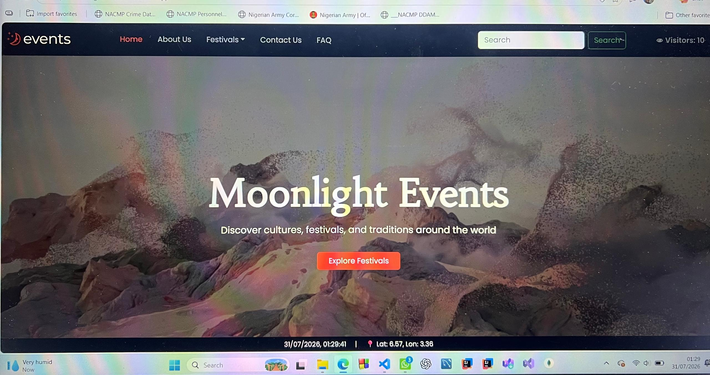

# 🌙 Moonlight Events

A modern event management website built with React, designed to showcase festivals, cultural celebrations, and special events through a clean, responsive, and interactive user interface.

---

## 📸 Preview



---

## ✨ Features

- 🎉 Browse upcoming festivals and events
- 🔍 Filter events by category and month
- 📄 View detailed festival information in a modal
- 📥 Download festival details as PDF
- 📱 Fully responsive design
- ⚡ Smooth animations and modern UI
- 🎨 Clean and accessible user interface

---

## 🛠 Tech Stack

- React
- JavaScript (ES6+)
- Bootstrap
- CSS3
- React Icons
- AOS (Animate On Scroll)
- jsPDF

---

## 🚀 Live Demo

https://moonlight-events-five.vercel.app

---

## 🌐 Portfolio

https://vincenteke.vercel.app

---

## 📂 Repository

https://github.com/vincentlawrencesnr/MoonlightEvents---Festival-App

---

## 📥 Installation

Clone the repository

```bash
git clone https://github.com/vincentlawrencesnr/Moonlight-Events.git
```

Navigate into the project

```bash
cd Moonlight-Events
```

Install dependencies

```bash
npm install
```

Run the development server

```bash
npm run dev
```

---

## 👨‍💻 Author

**Vincent Eke**

Software Engineer

📧 Email: vincentlawrence077@gmail.com

🌐 Portfolio: https://vincenteke.vercel.app

💼 LinkedIn:
https://www.linkedin.com/in/vincent-lawrence-9bb9023b4

🐙 GitHub:
https://github.com/vincentlawrencesnr
